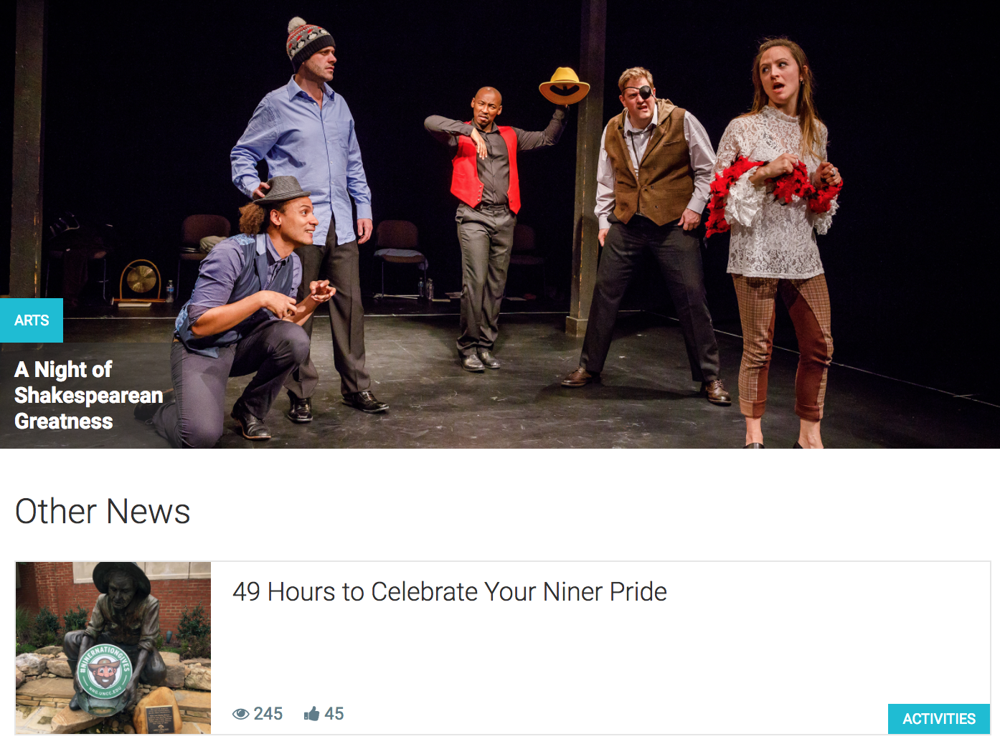
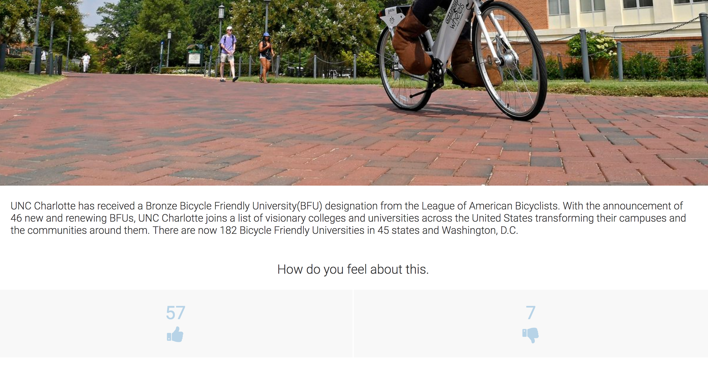
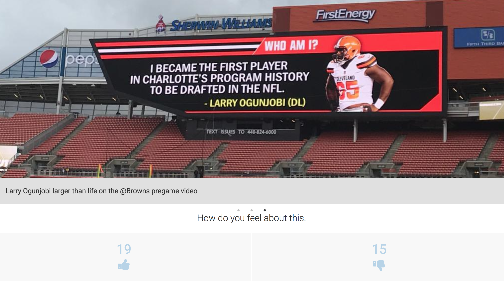

# Niner-News-UNCC

Deployed on AWS S3 @ [NinerNews : LiveDemo](http://ninernews.s3-website-us-east-1.amazonaws.com)          Refresh the app if data isn't loading

#### 1. If images/news aren't loading, please refresh the application or go to this url @ [REST-API](https://uncc-news-api.herokuapp.com/)  to wakeup the REST API on Heroku and then click the Live Demo. Heroku apps go to sleep if there's an inactivity for 30 minutes.

#### 2. Application Routing is still under development and refreshing a page may give you errors like 404 Not Found, Code: NoSuchKey. In such cases close the web page and re-open it by clicking on the given link.

## How to Run

Run `npm install` to download all the required Node Modules.

Once all the dependencies are installed. You can now go and start the application using the command `npm start`, which will start the application on port 3000 by default.

The application is fetching data from the UNCC News API at  @ https://uncc-news-api.herokuapp.com/

## What is done here?

This web application is a demostration of React application which uses Redux as state container and Redux-Promise as middleware.

Dashboard has News Feeds and Image gallery. Users can view the News headlines and can view each News post . The galley presents various pictures taken by UNCC students around the campus.

Deployed on AWS S3 @ [NinerNews : LiveDemo](http://ninernews.s3-website-us-east-1.amazonaws.com)

# Screenshots

## Home Page

Home Page -  This is opening/welcome page to the application showing various News Headlines and Students Image Gallery at the bottom.

## News Detail

Detail Page -  This page show the full detailed news post.

## Gallery Page

Gallery Page -  This page shows the pictures clicked by students.

